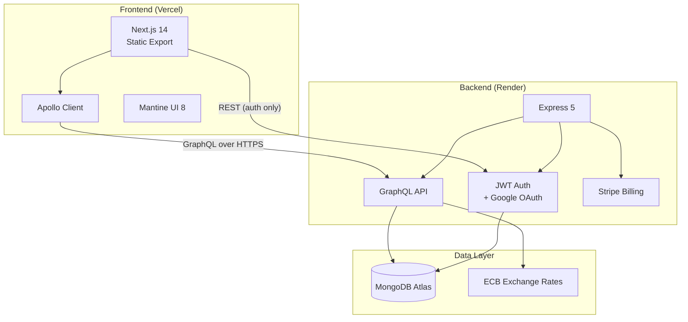
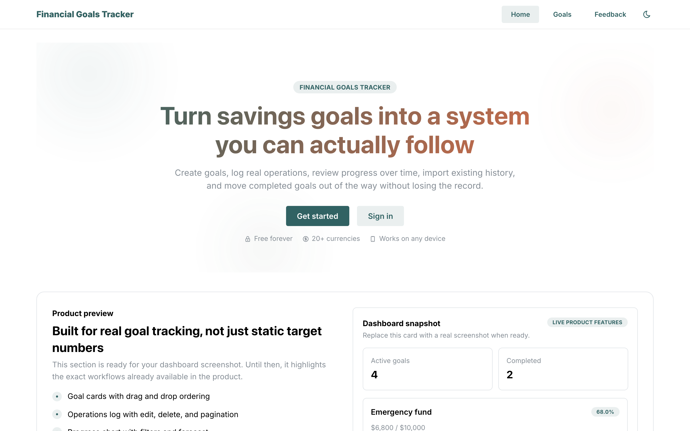
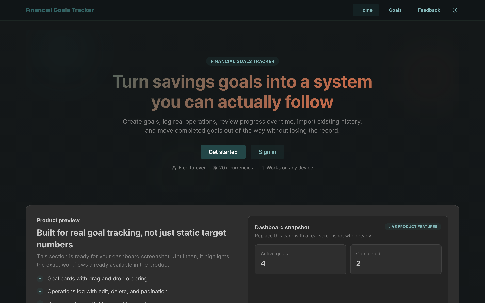
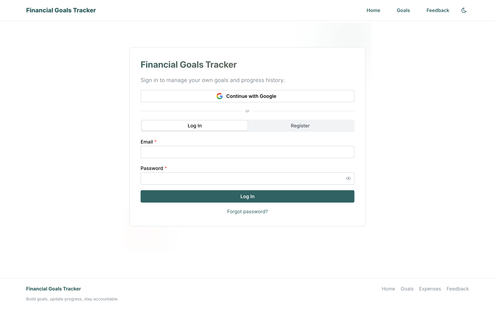
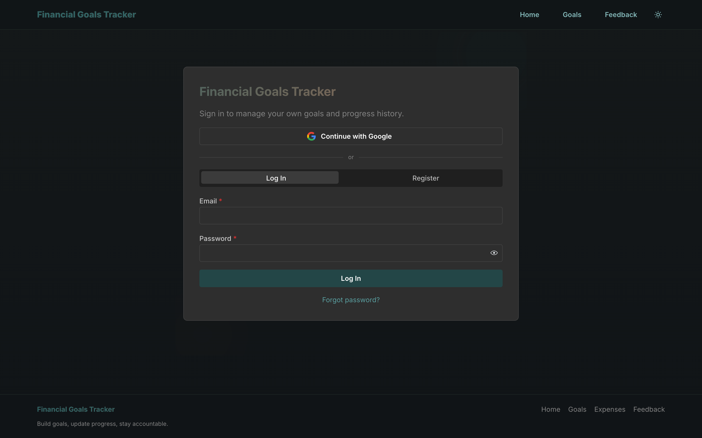
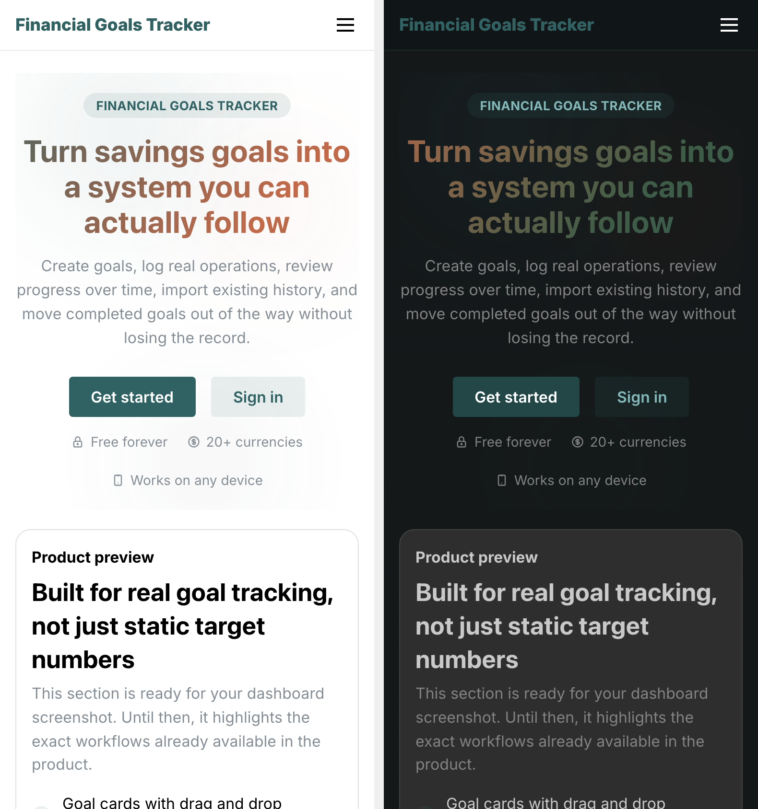

# Financial Goals Tracker

A production-grade SaaS for tracking savings goals with multi-currency support, real-time charts, and Stripe billing — built as a full-stack TypeScript monorepo.

<p align="center">
  
</p>

[]()
[]()
[]()
[]()

**Live:** [personal-finance-tracker.vercel.app](https://personal-finance-tracker-xyz.vercel.app) | **API:** [Render](https://personal-finance-tracker-7r75.onrender.com/health)

---

## Highlights

| | What | How |
|---|---|---|
| **Full-stack TypeScript** | Strict mode end-to-end | Next.js 14 + Express 5 + GraphQL |
| **1,007 automated tests** | Unit, integration, E2E | Jest + React Testing Library + Cypress |
| **Production security** | CSP, CSRF, account lockout, JWT rotation | Custom auth with token versioning |
| **Multi-currency** | 20+ currencies with live ECB rates | Frankfurter API with 24h MongoDB cache |
| **SaaS billing** | Free/Pro/Lifetime plans | Stripe Checkout + webhooks |
| **PWA** | Installable, offline-capable | Service worker + Web App Manifest |
| **Observability** | Structured JSON logs, request-ID correlation | Pino + custom middleware |
| **CI/CD** | Auto type-check, lint, test, build, deploy | GitHub Actions + Vercel + Render |

---

## Demo

<!-- TODO: Add 30-45 second screen recording GIF showing:
     landing page → sign up → create goal → add operation → chart animates → dark mode toggle → mobile view
     Recommended: Use Kap or LICEcap to record, keep under 10MB -->
<!--  -->

**Key flows:**
- Create and track savings goals with visual progress bars
- Record deposits/withdrawals with automatic chart updates
- Multi-currency conversion with live exchange rates
- Drag-and-drop goal reordering
- Data import/export (full portability)
- Google OAuth + email/password authentication

---

## Architecture



### Tech Stack

| Layer | Technologies |
|-------|-------------|
| Frontend | Next.js 14, React 18, TypeScript, Mantine 8, Apollo Client 4, Highcharts, Zustand |
| Backend | Node.js 20+, Express 5, TypeScript, GraphQL (graphql-http), Mongoose 8, Pino |
| Database | MongoDB (Atlas in prod) |
| Auth | Custom JWT (access + refresh), Google OAuth, HttpOnly cookies, CSRF protection |
| Payments | Stripe Checkout + Customer Portal + Webhooks |
| Email | Nodemailer (SMTP) |
| Hosting | Vercel (frontend) + Render (backend) |
| CI/CD | GitHub Actions (parallel: type-check, lint, test, build, E2E) |

---

## Screenshots

### Landing Page

| Light Mode | Dark Mode |
|:---:|:---:|
|  |  |

### Authentication

| Light Mode | Dark Mode |
|:---:|:---:|
|  |  |

### Mobile

<p align="center">
  
</p>

---

## Security

- Content-Security-Policy + Referrer-Policy headers
- CSRF protection via Origin/Referer validation
- Account lockout after 5 failed login attempts (15-minute cooldown)
- JWT with token versioning (revoke all sessions on password change)
- Rate limiting on all auth and API endpoints
- Request timeout (30s) to prevent resource exhaustion
- PBKDF2 password hashing (100K iterations, SHA-512)

---

## Plans & Billing

| Plan | Price | Features |
|------|-------|----------|
| Free | $0 | Up to 3 goals, operations log, themes, import/export |
| Pro | $5/mo | Unlimited goals, priority features |
| Lifetime | $12 once | Everything in Pro, forever |

Powered by Stripe Checkout with webhook-driven state management.

---

## Project Structure

```text
.
├── frontend/          Next.js app — see frontend/README.md
├── backend/           Express + GraphQL API — see backend/README.md
├── .github/           CI/CD workflows
└── docs/              Assets and architecture docs
```

## Getting Started

See the workspace READMEs for setup, scripts, and API docs:

- **[Frontend README](frontend/README.md)** — dev server, tests, environment variables
- **[Backend README](backend/README.md)** — API surface, endpoints, environment variables
- **[Contributing](CONTRIBUTING.md)** — workflow and expectations
- **[Security](SECURITY.md)** — vulnerability reporting

## License

See [`LICENSE`](LICENSE).
