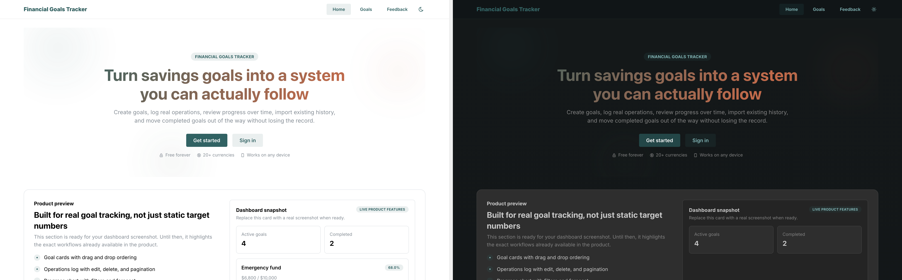
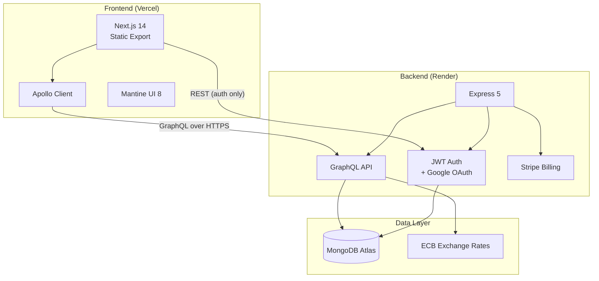

# Financial Goals Tracker

A production-grade SaaS for tracking savings goals with multi-currency support, real-time charts, and Stripe billing — built as a full-stack TypeScript monorepo.

<!-- TODO: Add hero screenshot (light + dark side-by-side, ~1200px wide) -->
<!--  -->

[]()
[]()
[]()
[]()

**Live:** [financial-goals-tracker.vercel.app](https://financial-goals-tracker.vercel.app) | **API:** [Render](https://personal-finance-tracker-7r75.onrender.com/health)

---

## Highlights

| | What | How |
|---|---|---|
| **Full-stack TypeScript** | Strict mode end-to-end | Next.js 14 + Express 5 + GraphQL |
| **1,005 automated tests** | Unit, integration, E2E | Jest + React Testing Library + Cypress |
| **Production security** | CSP, CSRF, account lockout, JWT rotation | Custom auth with token versioning |
| **Multi-currency** | 20+ currencies with live ECB rates | Frankfurter API with 24h MongoDB cache |
| **SaaS billing** | Free/Pro/Lifetime plans | Stripe Checkout + webhooks |
| **PWA** | Installable, offline-capable | Service worker + Web App Manifest |
| **Observability** | Structured JSON logs, request-ID correlation | Pino + custom middleware |
| **CI/CD** | Auto type-check, lint, test, build, deploy | GitHub Actions + Vercel + Render |

---

## Demo

<!-- TODO: Add 30-45 second screen recording GIF showing:
     landing page → sign up → create goal → add operation → chart animates → dark mode toggle → mobile view
     Recommended: Use Kap or LICEcap to record, keep under 10MB -->
<!--  -->

**Key flows:**
- Create and track savings goals with visual progress bars
- Record deposits/withdrawals with automatic chart updates
- Multi-currency conversion with live exchange rates
- Drag-and-drop goal reordering
- Data import/export (full portability)
- Google OAuth + email/password authentication

---

## Architecture



### Tech Stack

| Layer | Technologies |
|-------|-------------|
| Frontend | Next.js 14, React 18, TypeScript, Mantine 8, Apollo Client 4, Highcharts, Zustand |
| Backend | Node.js 20+, Express 5, TypeScript, GraphQL (graphql-http), Mongoose 8, Pino |
| Database | MongoDB (Atlas in prod) |
| Auth | Custom JWT (access + refresh), Google OAuth, HttpOnly cookies, CSRF protection |
| Payments | Stripe Checkout + Customer Portal + Webhooks |
| Email | Nodemailer (SMTP) |
| Hosting | Vercel (frontend) + Render (backend) |
| CI/CD | GitHub Actions (parallel: type-check, lint, test, build, E2E) |

---

## Screenshots

<!-- TODO: Add 2-3 screenshots showing different states:
     1. Dashboard with goals and chart (light mode)
     2. Dashboard (dark mode)
     3. Mobile view / PWA
     Place images in docs/assets/ directory -->

| Light Mode | Dark Mode | Mobile |
|:---:|:---:|:---:|
| <!--  --> | <!--  --> | <!--  --> |

---

## Project Structure

```text
.
├── frontend/          Next.js app (static export, deployed to Vercel)
│   ├── src/
│   │   ├── app/           App Router pages
│   │   ├── features/      Feature modules (dashboard, auth, profile, landing)
│   │   └── shared/        Shared hooks, components, utils, constants
│   └── cypress/           E2E tests
├── backend/           Express + GraphQL API (deployed to Render)
│   └── src/
│       ├── modules/       Domain modules (auth, goals, billing, analytics, proposals)
│       ├── db/            MongoDB models
│       └── utils/         Middleware, validation, logging
├── .github/           CI/CD workflows
└── docs/              Architecture docs and assets
```

---

## Getting Started

### Prerequisites

- Node.js 20+
- Yarn
- MongoDB instance (local or Atlas)

### Setup

```bash
# Install dependencies
cd frontend && yarn && cd ../backend && yarn && cd ..

# Configure backend
cp backend/.env.example backend/.env
# Edit .env: set MONGODB_URI and JWT_SECRET (min 32 chars)

# Start backend (terminal 1)
cd backend && yarn dev

# Start frontend (terminal 2)
cd frontend && yarn dev
```

Local URLs:
- Frontend: `http://localhost:3000`
- Backend: `http://localhost:4000`
- GraphQL playground (dev): `http://localhost:4000/graphql`

---

## Environment Variables

### Backend

See [`backend/.env.example`](backend/.env.example) for the full list.

| Variable | Required | Notes |
|----------|----------|-------|
| `MONGODB_URI` | Yes | MongoDB connection string |
| `JWT_SECRET` | Yes | Min 32 chars, generate with `openssl rand -base64 32` |
| `FRONTEND_ORIGIN` | No | Defaults to `http://localhost:3000` |
| `PORT` | No | Defaults to `4000` |
| `STRIPE_SECRET_KEY` | For billing | Stripe secret API key |
| `STRIPE_WEBHOOK_SECRET` | For billing | Stripe webhook signing secret |
| `SMTP_HOST`, `SMTP_PORT`, `SMTP_USER`, `SMTP_PASS` | No | Email sending (logs to console in dev) |

### Frontend

Works without `.env` when backend runs on `localhost:4000`.

| Variable | Required | Notes |
|----------|----------|-------|
| `NEXT_PUBLIC_API_URL` | No | Override backend URL |
| `NEXT_PUBLIC_GOOGLE_CLIENT_ID` | No | Google OAuth client ID |

---

## Scripts

### Frontend (`frontend/`)

| Command | Description |
|---------|-------------|
| `yarn dev` | Dev server |
| `yarn build` | Production build (static export) |
| `yarn test` | Unit tests (Jest) |
| `yarn test:coverage` | Tests with coverage |
| `yarn cypress:run` | E2E tests (headless) |
| `yarn lint` | ESLint |
| `yarn type-check` | TypeScript check |

### Backend (`backend/`)

| Command | Description |
|---------|-------------|
| `yarn dev` | Dev server with hot reload |
| `yarn build` | Compile TypeScript |
| `yarn test` | Unit tests (Jest) |
| `yarn lint` | ESLint |
| `yarn type-check` | TypeScript check |

---

## API Surface

### REST (Auth only)

| Method | Endpoint |
|--------|----------|
| POST | `/auth/register` |
| POST | `/auth/login` |
| POST | `/auth/refresh` |
| POST | `/auth/logout` |
| POST | `/auth/forgot-password` |
| POST | `/auth/reset-password` |
| POST | `/auth/change-password` |
| GET | `/auth/google` |
| GET | `/auth/verify-email?token=...` |
| POST | `/auth/delete-account` |

### GraphQL (`POST /graphql`)

All data operations: goals CRUD, operations tracking, data export/import, billing, proposals, analytics (admin).

### Health

- `GET /health` — uptime + MongoDB status
- `GET /healthcheck` — deep check with DB ping

---

## CI/CD Pipeline

GitHub Actions runs on every push/PR to `main`:

1. **Backend** — type-check, lint, tests (parallel)
2. **Frontend** — type-check, lint, tests + coverage (Codecov), build
3. **E2E** — Cypress against built app (non-blocking)

Auto-deploy: Vercel (frontend) + Render (backend) on merge to `main`.

---

## Security

- Content-Security-Policy + Referrer-Policy headers
- CSRF protection via Origin/Referer validation
- Account lockout after 5 failed login attempts (15-minute cooldown)
- JWT with token versioning (revoke all sessions on password change)
- Rate limiting on all auth and API endpoints
- Request timeout (30s) to prevent resource exhaustion
- PBKDF2 password hashing (100K iterations, SHA-512)

See [`SECURITY.md`](SECURITY.md) for vulnerability reporting.

---

## Plans & Billing

| Plan | Price | Features |
|------|-------|----------|
| Free | $0 | Up to 3 goals, operations log, themes, import/export |
| Pro | $5/mo | Unlimited goals, priority features |
| Lifetime | $12 once | Everything in Pro, forever |

Powered by Stripe Checkout with webhook-driven state management.

---

## Contributing

See [`CONTRIBUTING.md`](CONTRIBUTING.md) for workflow and expectations.

## License

See [`LICENSE`](LICENSE).
